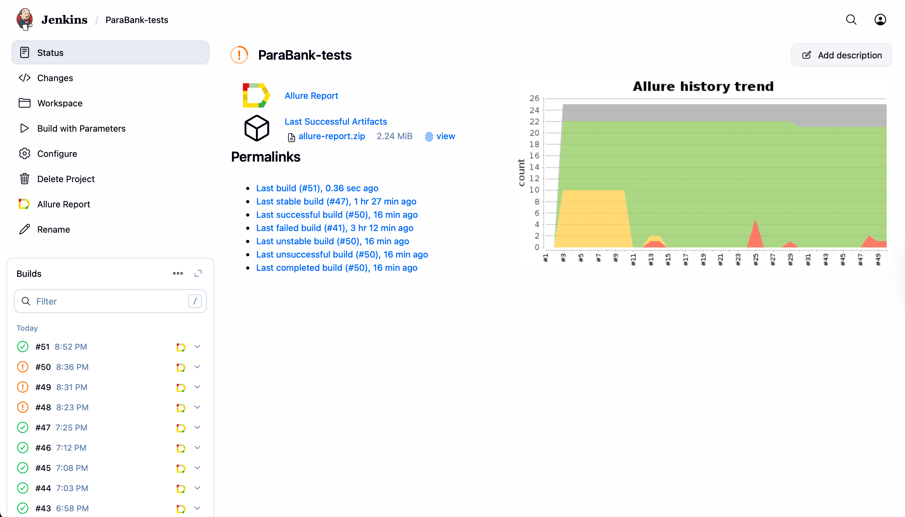
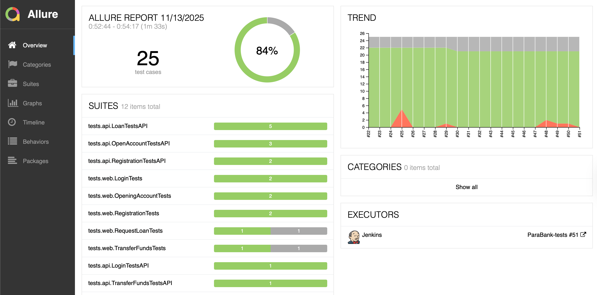
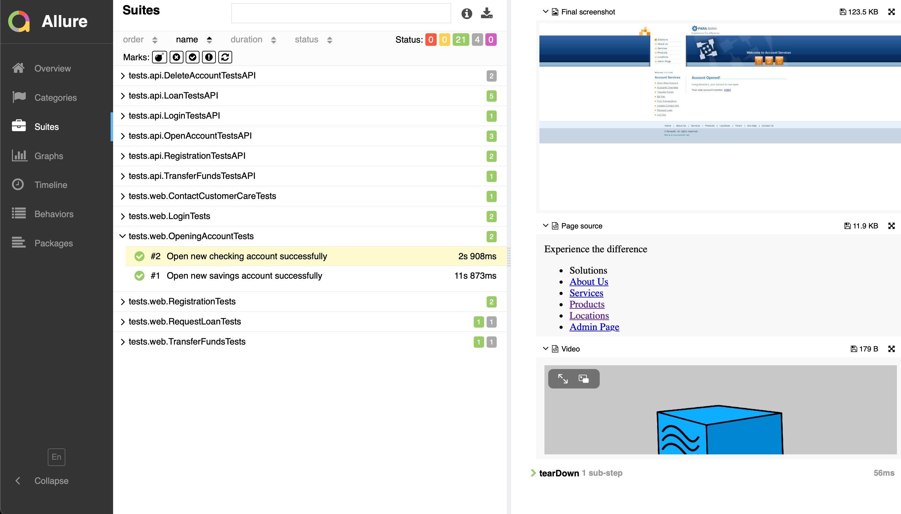
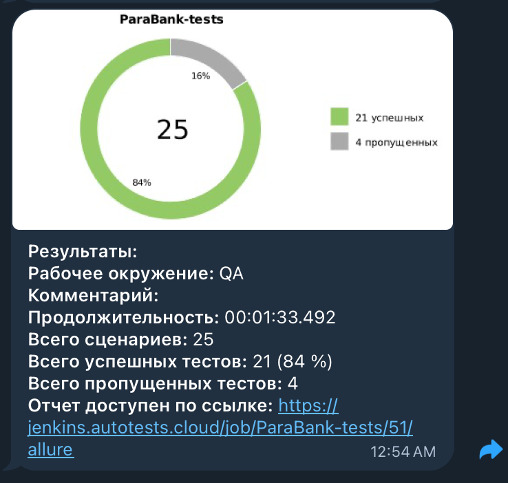

# 🧪 Проект автоматизации тестирования ParaBank

## 🌐 Описание проекта
Учебный проект по автоматизации тестирования банковского сайта [ParaBank](https://parabank.parasoft.com/parabank/index.htm).

Проект демонстрирует использование современных инструментов автоматизации тестирования, CI/CD, генерацию отчётности в Allure и интеграцию с Telegram-уведомлениями через Jenkins.

---

## 🧰 Стек технологий

  
  
  
  
  
  
  
  

| Категория | Технологии                                                                                 |
|------------|--------------------------------------------------------------------------------------------|
| Язык программирования | [**Java 17**](https://www.java.com/)                                                       |
| Сборщик | [**Gradle**](https://gradle.org/)                                                          |
| Тестовый фреймворк | [**JUnit 5**](https://junit.org/junit5/)                                                   |
| UI-тестирование | [**Selenide**](https://selenide.org/)                                                      |
| API-тестирование | [**REST Assured**](https://rest-assured.io/)                                               |
| Отчётность | [**Allure Report**](https://allurereport.org/)                                             |
| CI/CD | [**Jenkins**](https://www.jenkins.io/)                                                     |
| Уведомления | [**Telegram Bot + Allure Notifications**](https://github.com/qa-guru/allure-notifications) |
| IDE | [**IntelliJ IDEA**](https://www.jetbrains.com/idea/)                                       |
| Система контроля версий | [**GitHub**](https://github.com/)                                                          |

---

## 🧩 Реализованные тесты (UI + API)

- ✅ Авторизация с валидными/невалидными данными
- ✅ Регистрация нового пользователя
- ✅ Открытие расчётного/сберегательного счёта
- ✅ Перевод средств между счетами
- ✅ Оформление заявки на займ
- ✅ Заполнение формы для связи с поддержкой
- ✅ Проверка статуса ответа при неверных запросах

---

## ⚙️ Запуск тестов

### Локальный запуск:
gradle clean test -Denv=local

### Удалённый запуск через Selenoid:
gradle clean test -Denv=remote

### Запуск в Jenkins:
clean test -Denv=jenkins

---
#   Запуск тестов

## [Сборка в Jenkins](https://jenkins.autotests.cloud/job/ParaBank-tests/)

  

- На странице проекта доступна информация о последних сборках и график успешности прохождения тестов из Allure-отчёта

---
#   Интеграция с Allure

## Основное окно

## Тесты

- К каждой проверке прилагается скриншот страницы последнего действия в тесте, логи и видео

---
#   Allure уведомления в Telegram
